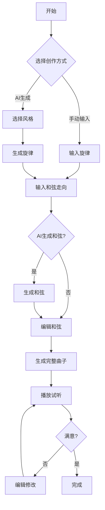

## 1. Product Overview
一款基于Web的音乐创作软件，支持旋律输入、和弦走向编辑、AI生成完整曲子，具有播放和编辑功能，并支持多种音乐风格自定义。

## 2. Core Features

### 2.1 User Roles
| Role | Registration Method | Core Permissions |
|------|---------------------|------------------|
| User |无需注册 |使用所有核心功能 |

### 2.2 Feature Module
1. **旋律编辑器**: 手动输入旋律、AI生成旋律、旋律编辑
2. **和弦编辑器**: 手动输入和弦走向、AI生成和弦、和弦编辑
3. **曲子生成**: 根据旋律和和弦生成完整曲子
4. **播放控制**: 试听生成的曲子
5. **风格选择**: 支持流行、古典、爵士、电子等风格

### 2.3 Page Details
| Page Name | Module Name | Feature description |
|-----------|-------------|---------------------|
| 主页面 | 旋律编辑器 | 五线谱/简谱输入、MIDI导入、AI生成旋律、音符编辑 |
| 主页面 | 和弦编辑器 | 和弦走向输入、AI生成和弦、和弦编辑 |
| 主页面 | 曲子生成器 | 合并旋律与和弦、调用AI生成完整曲子 |
| 主页面 | 播放控制 | 播放/暂停/停止、进度条、音量控制 |
| 主页面 | 风格选择器 | 风格切换、参数调整 |

## 3. Core Process

## 4. User Interface Design
### 4.1 Design Style
- Primary color: #6366f1 (Indigo) - 现代科技感
- Secondary color: #f59e0b (Amber) - 活力点缀
- Button style: rounded-lg, gradient hover effects
- Font: Inter, monospace for musical notation
- Layout: Card-based, dark theme
- Icon style: Music-themed, minimal

### 4.2 Page Design Overview
| Page Name | Module Name | UI Elements |
|-----------|-------------|-------------|
| 主页面 | 旋律编辑器 | 五线谱显示、音符输入框、生成按钮 |
| 主页面 | 和弦编辑器 | 和弦网格、和弦选择器 |
| 主页面 | 播放控制 | 播放按钮组、进度条、音量滑块 |
| 主页面 | 风格选择器 | 风格标签、参数调节 |

### 4.3 Responsiveness
- Desktop-first design
- Mobile-adaptive layout with collapsible panels
- Touch-optimized controls

### 4.4 3D Scene Guidance
- No 3D elements required for this project
