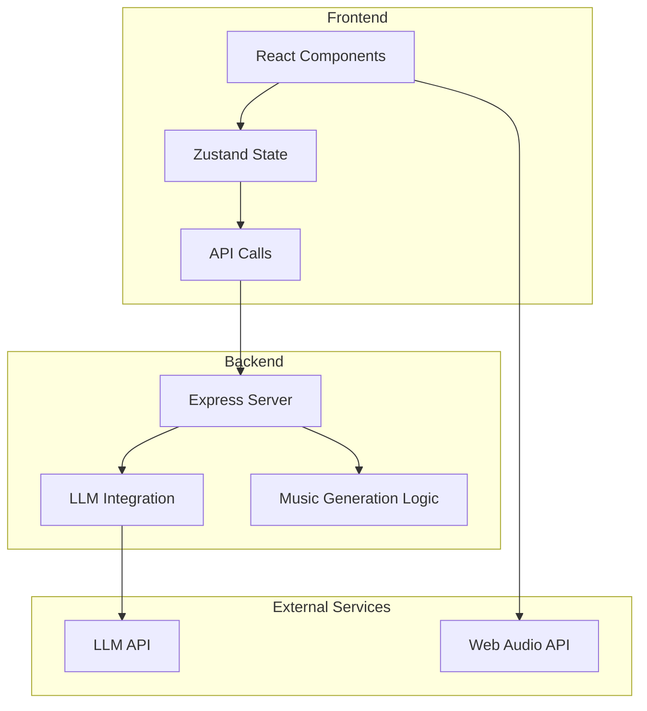
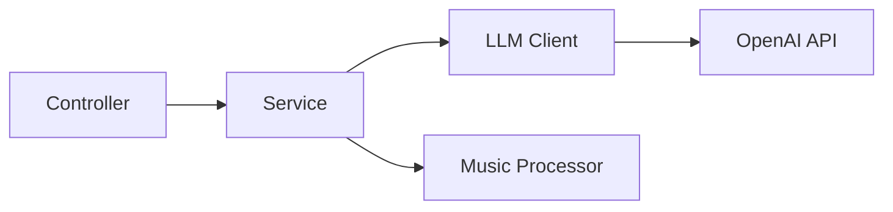
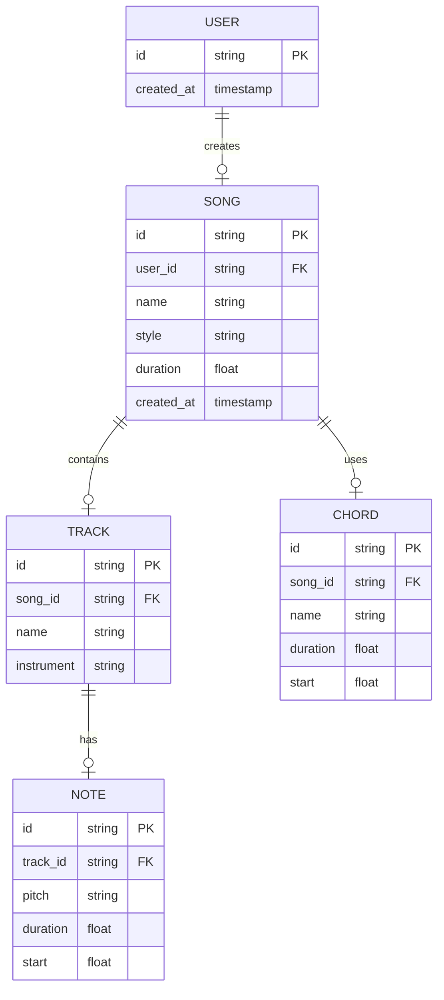

## 1. Architecture Design


## 2. Technology Description
- Frontend: React@18 + TypeScript + TailwindCSS@3 + Vite
- State Management: Zustand
- Audio Playback: Web Audio API + Tone.js
- Backend: Express@4 + TypeScript
- LLM Integration: OpenAI API
- Icons: Lucide React

## 3. Route Definitions
| Route | Purpose |
|-------|---------|
| / | 主页面，包含所有编辑器 |

## 4. API Definitions
### 4.1 Generate Melody
**POST** `/api/melody/generate`
```typescript
interface GenerateMelodyRequest {
  style: 'pop' | 'classical' | 'jazz' | 'electronic';
  length: number;
  key?: string;
}

interface GenerateMelodyResponse {
  success: boolean;
  melody: Note[];
}

interface Note {
  pitch: string;
  duration: number;
  start: number;
}
```

### 4.2 Generate Chords
**POST** `/api/chords/generate`
```typescript
interface GenerateChordsRequest {
  style: 'pop' | 'classical' | 'jazz' | 'electronic';
  length: number;
  key?: string;
}

interface GenerateChordsResponse {
  success: boolean;
  chords: Chord[];
}

interface Chord {
  name: string;
  duration: number;
  start: number;
}
```

### 4.3 Generate Song
**POST** `/api/song/generate`
```typescript
interface GenerateSongRequest {
  melody: Note[];
  chords: Chord[];
  style: 'pop' | 'classical' | 'jazz' | 'electronic';
}

interface GenerateSongResponse {
  success: boolean;
  song: Song;
}

interface Song {
  tracks: Track[];
  duration: number;
}

interface Track {
  name: string;
  notes: Note[];
}
```

## 5. Server Architecture Diagram


## 6. Data Model
### 6.1 Data Model Definition


### 6.2 Data Definition Language
```sql
CREATE TABLE users (
    id TEXT PRIMARY KEY,
    created_at TIMESTAMP DEFAULT CURRENT_TIMESTAMP
);

CREATE TABLE songs (
    id TEXT PRIMARY KEY,
    user_id TEXT REFERENCES users(id),
    name TEXT NOT NULL,
    style TEXT NOT NULL,
    duration FLOAT NOT NULL,
    created_at TIMESTAMP DEFAULT CURRENT_TIMESTAMP
);

CREATE TABLE tracks (
    id TEXT PRIMARY KEY,
    song_id TEXT REFERENCES songs(id),
    name TEXT NOT NULL,
    instrument TEXT NOT NULL
);

CREATE TABLE notes (
    id TEXT PRIMARY KEY,
    track_id TEXT REFERENCES tracks(id),
    pitch TEXT NOT NULL,
    duration FLOAT NOT NULL,
    start FLOAT NOT NULL
);

CREATE TABLE chords (
    id TEXT PRIMARY KEY,
    song_id TEXT REFERENCES songs(id),
    name TEXT NOT NULL,
    duration FLOAT NOT NULL,
    start FLOAT NOT NULL
);
```
